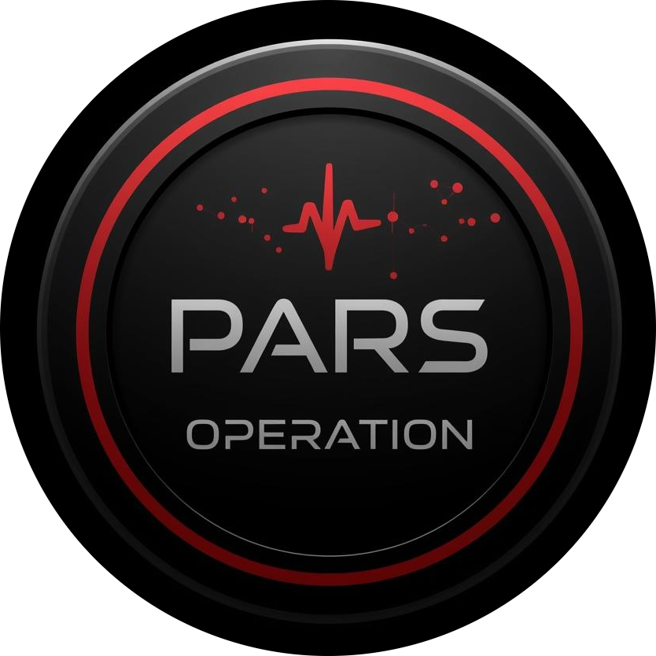
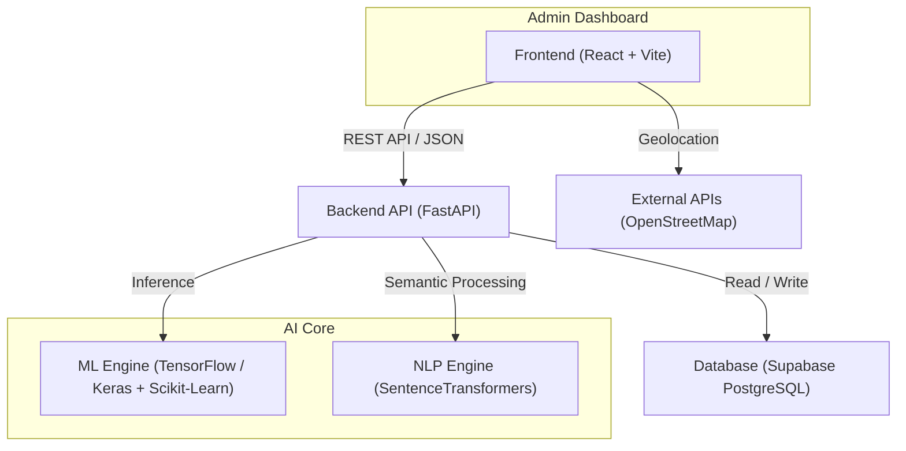
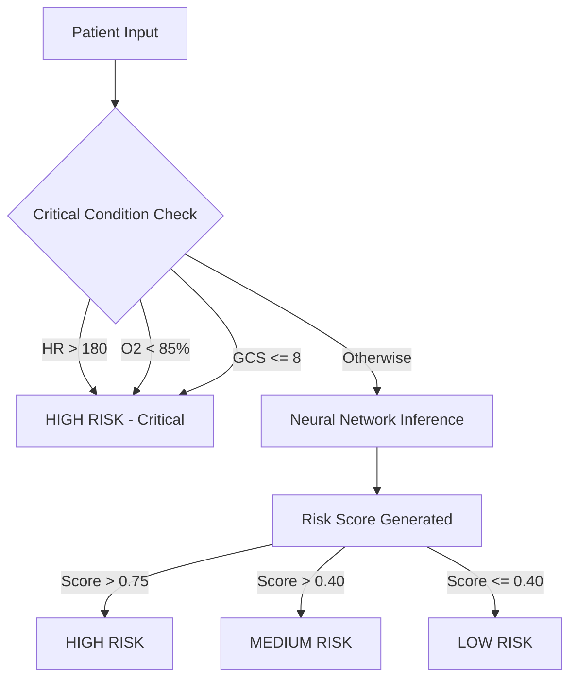
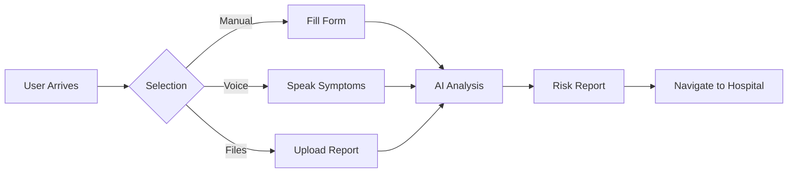
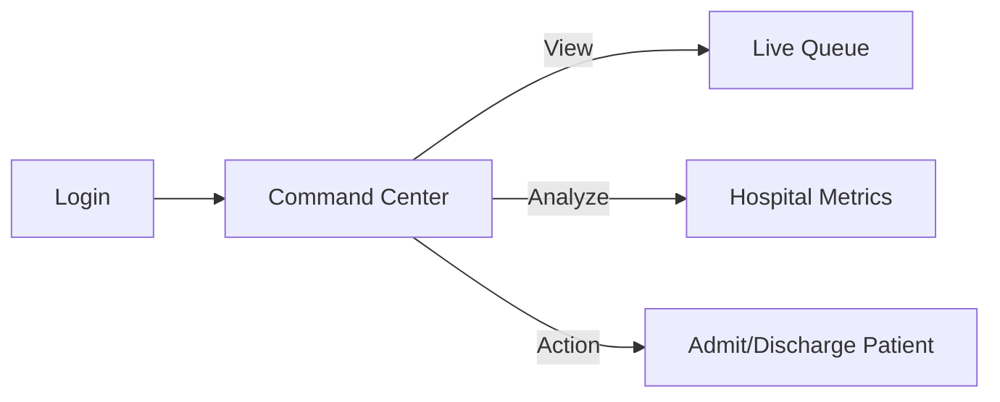

# PARS - Patient Assessment & Risk Stratification System



> **Hackathon Winning Project** | **Medical-Grade AI Triage System**

PARS is a state-of-the-art **AI-Powered Triage System** designed to revolutionize emergency room efficiency. By leveraging machine learning and real-time data processing, PARS automatically prioritizes patients based on vital signs and chief complaints, ensuring that critical cases receive immediate attention.

# Project Title: AI-Powered Smart Patient Triage System (Hackathon Winner)
## 1. Tech Stack
- **Frontend:** React (Vite), Tailwind CSS, Framer Motion (for smooth animations), Lucide React (icons), Recharts (for risk charts).
- **Backend:** Python FastAPI (standard for ML integration).
- **Database:** SQLite (for simplicity) using SQLAlchemy.
- **ML Engine:** Python (TensorFlow/Keras + Scikit-Learn logic).
- **NLP


---

## 🏗️ System Architecture

The system follows a modern **Client-Server Architecture** with a decoupled AI Engine.



---

## 🚀 Key Features

*   **Real-Time AI Triage**: Instantly categorizes patients into High, Medium, or Low risk using a Neural Network.
*   **Automatic Department Referral**: Uses NLP (BERT-based models) to route patients to the correct specialist (e.g., "Chest pain" -> Cardiology).
*   **Live Patient Queue**: A dynamic, color-coded dashboard for doctors to monitor incoming patients.
*   **Voice-to-Text Intake**: Multilingual voice recognition for hands-free patient data entry.
*   **OCR Integration**: Upload medical reports (PDF/Images) to auto-fill patient history.
*   **Hospital Locator**: Integrated geolocation to find the nearest emergency facility.
*   **Internationalization (i18n)**: Full support for 6+ languages (English, Hindi, Tamil, Telugu, Bengali, etc.).

---

## 🛠️ Tech Stack

### **Frontend**
*   **Framework**: [React](https://react.dev/) + [Vite](https://vitejs.dev/) (Fast Hardware-Accelerated Build Tool)
*   **Styling**: [Tailwind CSS](https://tailwindcss.com/) (Utility-first CSS), [Shadcn UI](https://ui.shadcn.com/) (Accessible Components)
*   **Animations**: [Framer Motion](https://www.framer.com/motion/) (Complex UI transitions)
*   **Icons**: Lucide React
*   **Charts**: Recharts (Medical data visualization)
*   **State Management**: React Query (Server state), Context API (Auth)

### **Backend**
*   **API Framework**: [FastAPI](https://fastapi.tiangolo.com/) (High-performance Python web framework)
*   **Server**: Uvicorn (ASGI Server)
*   **Database**: Supabase (PostgreSQL with Realtime capabilities)

### **Machine Learning & AI**
*   **Core Engine**: TensorFlow / Keras (Sequential Neural Networks)
*   **Preprocessing**: Scikit-Learn (StandardScaler, OneHotEncoder)
*   **NLP**: SentenceTransformers (Hugging Face `all-MiniLM-L6-v2`) for semantic similarity.
*   **OCR**: PyMuPDF / Tesseract (Document parsing)

---

## 🧠 ML & Triage Logic

### **1. Risk Stratification Model**
The heart of PARS is a **Neural Network (Sequential Model)** trained on `patients_data.csv`.

*   **Inputs (22 Features)**: Age, Gender, Heart Rate, BP (Sys/Dia), O2, Temp, Resp Rate, Pain Score, GCS, Medical History (Diabetes, etc.).
*   **Architecture**:
    *   Input Layer (64 neurons, ReLU)
    *   Hidden Layers (Dropout for regularization)
    *   Output Layer (Sigmoid activation) -> Returns a **Risk Score (0.0 - 1.0)**.

### **2. Safety Guardrails (Hybrid Approach)**
To prevent AI errors in critical scenarios, we implement **Rule-Based Overrides** before neural inference.



### **3. NLP Department Classifier**
Uses **Sentence-BERT** to map chief complaints to medical departments via **Cosine Similarity**.
*   *Input*: "My chest feels heavy and hurts"
*   *Embedding Match*: Matches "Cardiology" vector space.
*   *Output*: **Cardiology** (Referral).

---

## 📂 Component & Page Breakdown

### **1. Pages (`src/pages/`)**

| Page | Description | Key Features |
| :--- | :--- | :--- |
| **Login (`Login.tsx`)** | Dual-mode authentication portal. | • **Staff Portal**: Secure doctor login.<br>• **Patient Portal**: Kiosk mode access.<br>• **Video Background**: Immersive medical ambience.<br>• **i18n**: Language switcher. |
| **Dashboard (`Dashboard.tsx`)** | The "Command Center" for medical staff. | • **Live Stats**: Bed availability, critical count.<br>• **Patient Queue**: Real-time sorting by acuity.<br>• **Admit/Discharge**: One-click actions. |
| **PatientIntake (`PatientIntake.tsx`)** | Patient self-check-in kiosk. | • **Voice Input**: "I have a headache."<br>• **Simulated Vitals**: Connects to dummy wearable.<br>• **GPS Map**: Finds nearest hospital.<br>• **Auto-Triage**: Instant AI result display. |

### **2. Key Components (`src/components/`)**

*   **`AdminStats.tsx`**: Visualizes hospital KPIs using `Recharts`.
    *   *Charts*: Arrival trends, Department volume, Risk distribution (Pie).
*   **`PatientQueue.tsx`**: The core list view.
    *   *Features*: Animated re-ordering when new high-risk patients arrive. Uses `Framer Motion` for layout transitions.
*   **`VitalsMonitor.tsx`**: A realistic ECG simulation.
    *   *Tech*: Animated SVC graphs representing Heart Rate and SpO2 waveforms. Allows manual "Simulation Mode" (e.g., triggering Tachycardia).

---

## ⚙️ Installation & Setup

### **Prerequisites**
*   Node.js (v18+)
*   Python (3.9+)
*   Git

### **1. Clone Repository**
```bash
git clone https://github.com/YourRepo/PARS.git
cd patient_pars
```

### **2. Backend Setup (FastAPI)**
```bash
cd backend
python -m venv venv
# Windows:
venv\Scripts\activate
# Mac/Linux:
source venv/bin/activate

pip install -r requirements.txt
python -m uvicorn main:app --reload
```
*Server will start at `http://localhost:8000`*

### **3. Frontend Setup (React)**
```bash
# Open a new terminal root directory
npm install
npm run dev
```
*App will run at `http://localhost:8000` (Vite Default)*

---

## 🧪 Testing & Validation

### **Running the Triage Model Manually**
You can test the AI logic without the frontend using the provider script:
```bash
cd backend
python test_api.py
```

### **Training a New Model**
To retrain the Neural Network on new data:
1.  Update `patients_data.csv`.
2.  Run:
    ```bash
    python train.py
    ```
3.  This replaces `triage_model_nn.keras` with the improved version.

---

## 🗺️ User Flows

### **Patient Journey (Kiosk Mode)**


### **Doctor/Admin Journey**

